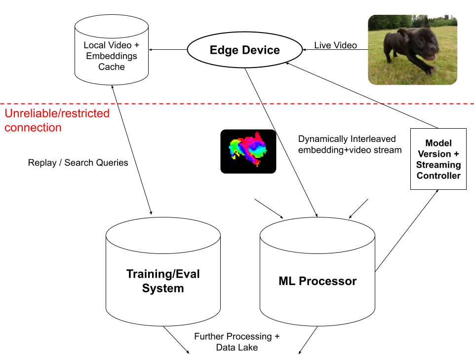

# System Design Plan

## Overview

StreamBed is designed to more efficiently handle inference, evaluation, and training on vision models intended to run on edge devices. Video is streamed onto an edge device with basic compute capability, with embeddings generated locally. All services are run through containers. \
\
A dynamic stream is then sent to a server container through a custom StreamBed streaming protocol, where further model inference/training can take place. \
\
StreamBed also includes a local data cacheing system. A secure API is exposed on the edge device, allowing for server video retrieval requests to retrieve embeddings corresponding to a specific timestamp interval. \
\
Model versioning is controlled through a centralized controller service, synchronizing embedding models between edge devices and server containers.

# Design

## StreamBed Streaming Protocol

### Vishnu + Fred

Our custom protocol is built atop UDP (python sockets) on the application layer, minimizing overhead on the network. The protocol adds header data on model versioning, data source, timestamps, and frame interleaving rate. \
\
The protocol also includes a handshake system to synchronize updates to streaming.

We choose the UDP approach because of the minimal overhead, extendible data/metadata, and continuous framing. Plain HTTP/REST has high per-frame overheads (hard to stream); TCP sockets introduce custom framing complexity and more overhead than UDP; WebSocket/gRPCs require extra dependencies while still using TCP; and Manual Polling on edge devices is simple but lacks scalability and loses on the real-time aspect.

## StreamBed Controller

### Ashish

The streambed controller uses a distributed database system to coordinate streaming sources/destinations, as well as model versioning across edge devices and servers. The controller is designed to minimize loss of data, globally unique identifiers, and eventual consistency with model updates.

## Inference Containers

### Ivan

The inference system is separated into distinct containers running on the edge device and servers. These systems automatically update from the StreamBed controller, and primarily function as a wrapper for machine learning inference. \
\
Video frames are stored locally on edge even if not streamed, and can be retrieved asynchronously through an API query. This data is stored with a dynamic TTL based on remaining available disk space.

# Testing Framework

### Vishnu + Fred

Testing for StreamBed will extend to unit testing on the various methods themselves, as well as full network simulation testing. \
\
We will use containers and custom network throughput constraints to test the inference and compression capabilities of the system. \
\
We will measure overall "frame throughput" (how many frames can be processed a second across a spotty network), adaptability to changing network conditions, and inference accuracy. Our baseline will be a non-distributed computation system, with videos directly streamed via socket to a server.
